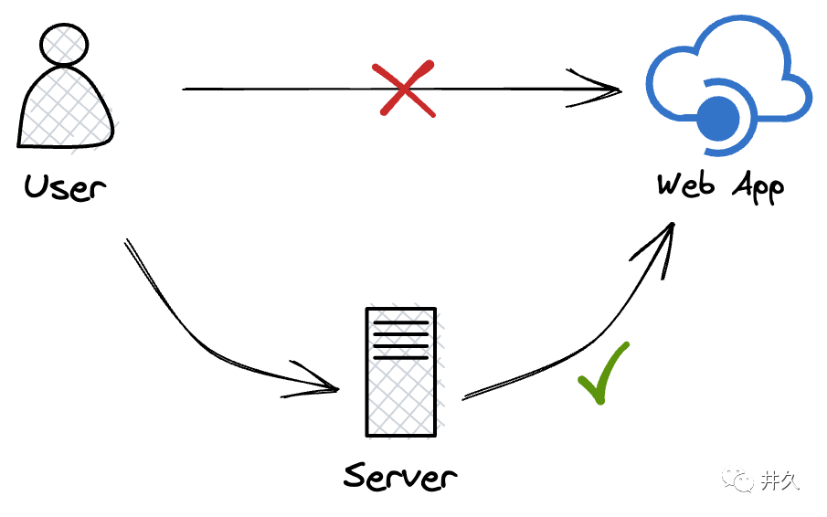
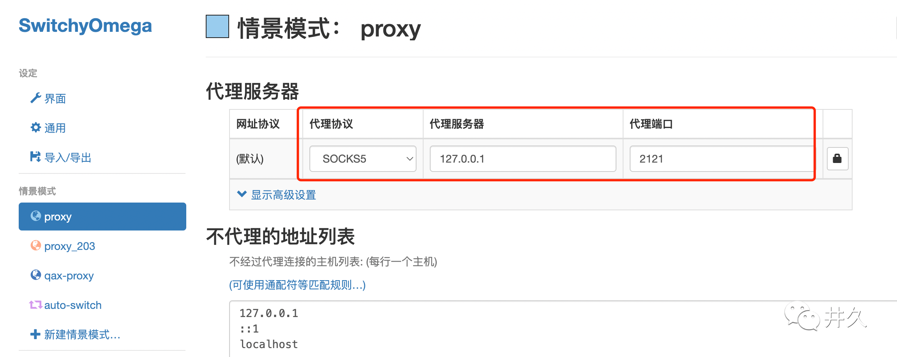
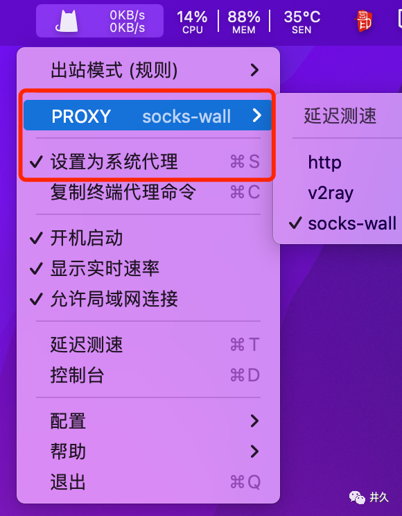
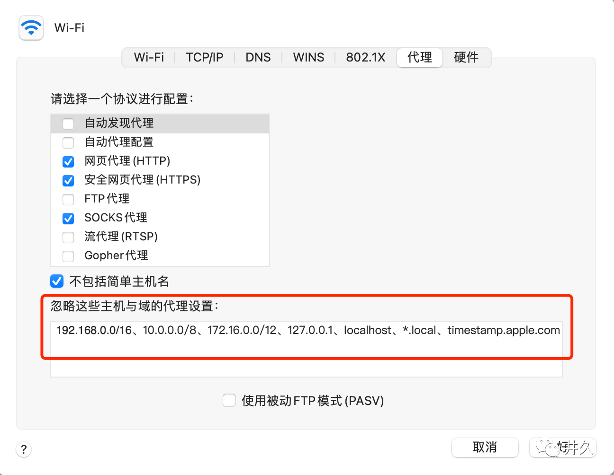

目前我使用代理的场景主要有以下两种：

1. 访问国外的一些网站。
2. 访问公司内部的一些网站，但是有 ACL 限制。

## 原理



想要访问网络不可达的网站，可以使用一个能访问网站的服务器做代理。

## 制作代理

制作代理的方式有多种，SSH 动态转发无疑是最快捷的一种。

#### SSH 动态转发

[动态转发](https://wangdoc.com/ssh/port-forwarding.html "动态转发")指的是，本机与 SSH 服务器之间创建了一个加密连接，然后本机内部针对某个端口的通信，都通过这个加密连接转发。

动态转发的命令格式：`ssh -D <本地端口> <代理主机> -N`

其中 `-D` 表示动态转发，`-N` 表示只充当隧道，不执行远程命令。

举例来说，如果本地端口是 2121，代理服务器 ip 为 10.10.10.2(随意写的哈)，那么动态转发的命令就是下面这样。

```
$ ssh -D 2121 10.10.10.2 -N
```

## 使用代理

#### 终端使用

动态转发采用了 SOCKS5 协议。访问外部网站时，需要把 HTTP 请求转成 SOCKS5 协议。

```
$ curl -x socks5://localhost:2121 https://www.google.com
```

也可以设置 http_proxy 环境变量，将 SOCKS5 转换为 HTTP 代理。

```
$ export http_proxy="socks5://localhost:2121"
$ export https_proxy=$http_proxy
$ curl https://www.google.com
```

#### 浏览器使用

1. [Proxy SwitchyOmega](https://chrome.google.com/webstore/detail/proxy-switchyomega/padekgcemlokbadohgkifijomclgjgif "Proxy SwitchyOmega")

Proxy SwitchyOmega 是 Chrome 浏览器的一个插件。安装后可以新建一个 Proxy 情景模式，参考配置如下：



2. [ClashX](https://github.com/yichengchen/clashX/releases "ClashX")
   
ClashX 是一款代理客户端应用，安装后可以修改配置文件增加 sock5 代理，参考配置如下：

```
...略...

# socks5
- name: "socks-wall"
  type: socks5
  server: localhost
  port: 2121

# 代理节点选择
- name: "PROXY"
  type: select
  proxies:
    - "socks-wall"

...略...
```

然后选择对应的 PROXY，设置为系统代理，即可访问。


注意，如果要转发的地址是内网地址，需要注意一下 wifi 设置里面的代理设置，里面针对一些内网地址是不走代理转发的。


如果需要经常使用动态转发，可以将动态转发的命令写入 SSH 客户端的个人配置文件 `~/.ssh/config`

```
DynamicForward <代理主机>:<本地端口>
```

另外，动态转发的命令，默认需要输入当前用户的密码，如果想免密，可以了解一下 `ssh-kengen`，本文不再详细阐述。