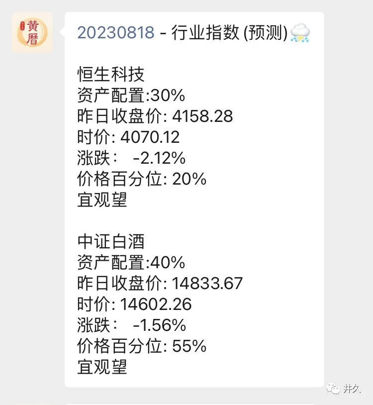
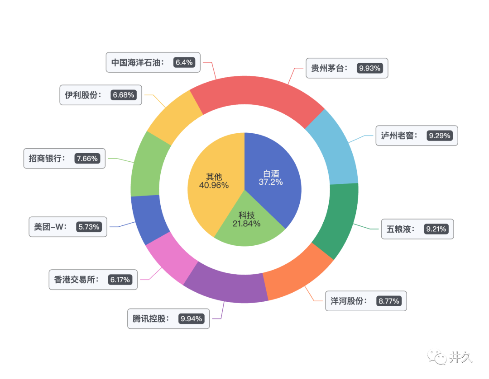
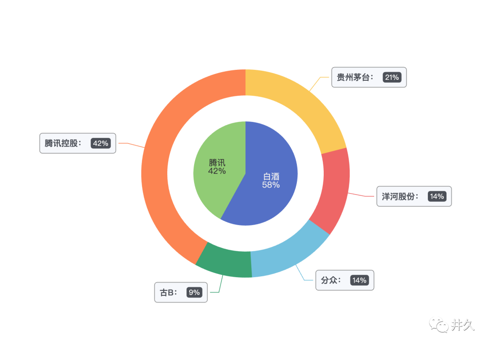
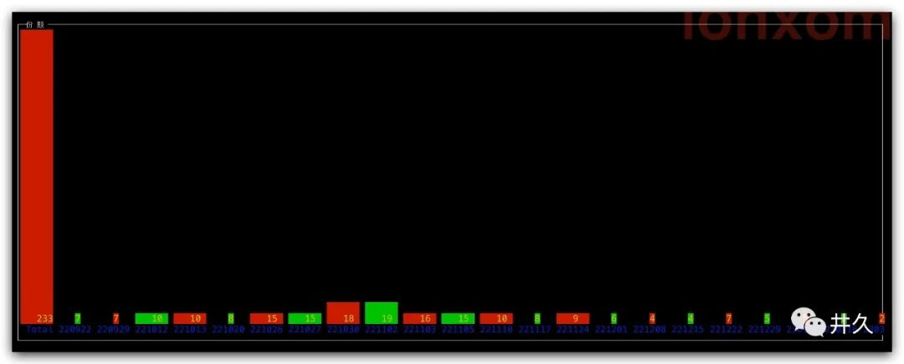
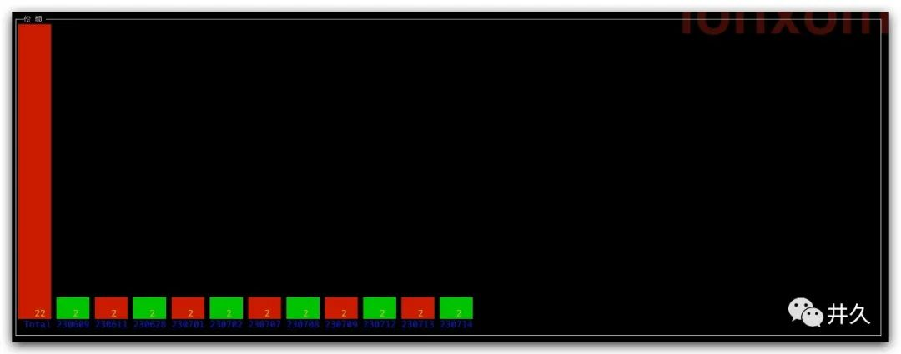

我曾提到，我的[宽基指数组合](https://mp.weixin.qq.com/s/6xUmJdwWizEL0H7KDv9pYw)在防守方面表现优秀，但在进攻上稍显不足。近期，我在投资体系中引入了新的元素：行业指数组合。

>关注公众号井久，交易日下午12-3点回复”黄历“可获得

接下来，我将详细介绍我的行业指数投资组合体系。

### 1. 投资标的与资产配置
投资标的应该说是投资体系中最重要的部分，也是最难的部分，我主要参考了知名投资人，一个是张坤的易方达蓝筹精选混合，一个是唐书房的持仓。

张坤的易方达蓝筹精选组合大家应该比较熟悉，这是2023年6月30日易方达蓝筹精选的持仓分布：

唐书房也是巴菲特的忠实信徒，以下是截止到2023年8月18日的持仓分布：

他们的共同持仓包括白酒消费和腾讯。唐书房的持仓相对更为激进。我尊重他们的投资智慧，但我坚持只买指数基金，不买个股和主动基金。因此，我根据他们的持仓找到了对应的指数基金，投资标的与资产配置如下：

基金|代码|百分比|
---|---|-----|
招商中证白酒指数(LOF)A|161725|20%|
招商中证白酒指数(LOF)C|012414|20%|
易方达恒生科技ETF联接(QDII)A|013308|15%|
易方达恒生科技ETF联接(QDII)C|013309|15%|
广发中债7-10年国开债指数A|003376|15%|
招商产业债券A|217022|15%|

### 2. 仓位设计
仓位设计涉及资金的规划，包括存量资金，增量资金，每月定投额，定投周期，风险控制等。

我坚持以宽基为主，行业为辅的投资理念。目前，我将宽基与行业的仓位比例设计为2:1。宽基组合的总仓位是720份，因此行业指数组合的总仓位设计为360份。

我选择每周二作为定投周期，并设定三年为建仓期。

建仓完成后，我将行业指数与债券的比例控制在60:40至80:20的范围内，超出范围则实施动态平衡。

### 3. 买卖信号和买卖份额
我根据指数价格的历史百分位来判断买卖信号。以我购买的恒生科技指数为例，当价格低于历史百分位10%时，我会发出买入信号；当价格高于60%时，我会发出卖出信号。

投资份数的计算公式来源于《指数基金定投指南》第五章第五节：估值百分位法。这种方法的目标是在市场下跌时增加投入。

$$ 买入份数 = \left(\frac{1}{{1 - 期待百分位 + 当前百分位}}\right)^n $$

以恒生科技指数为例，我将期待百分位设为0.2，放大系数n设为15。

根据上述公式，我得到了价格百分位与投资份数的关系表：

百分位|份数|
---|---|
10| 5
8 |7
6 |10
4 |14
2 |20
0 |28

### 4. 临时加仓

为了不错过重大行情，我设定了临时加仓机制。具体策略如下：

* 宜买入的份额 >=10
* 当日下跌幅度超过价格百分位的2/10，比如价格百分位为 20%,那么单日下跌需要超过 4%。

### 5. 回测

如果完全按照目前的指数黄历指示来投资，将会在下面时间点买入。

最后，我想说明，我的行业指数投资体系是基于对知名投资人的持仓分析，以及自我对风险和收益的平衡。这个体系刚开始实施，尚未经历实战的充分考验，我会在执行过程中进行持续的调整和优化。**我相信，只有知行合一，才能在投资市场取得成功。**